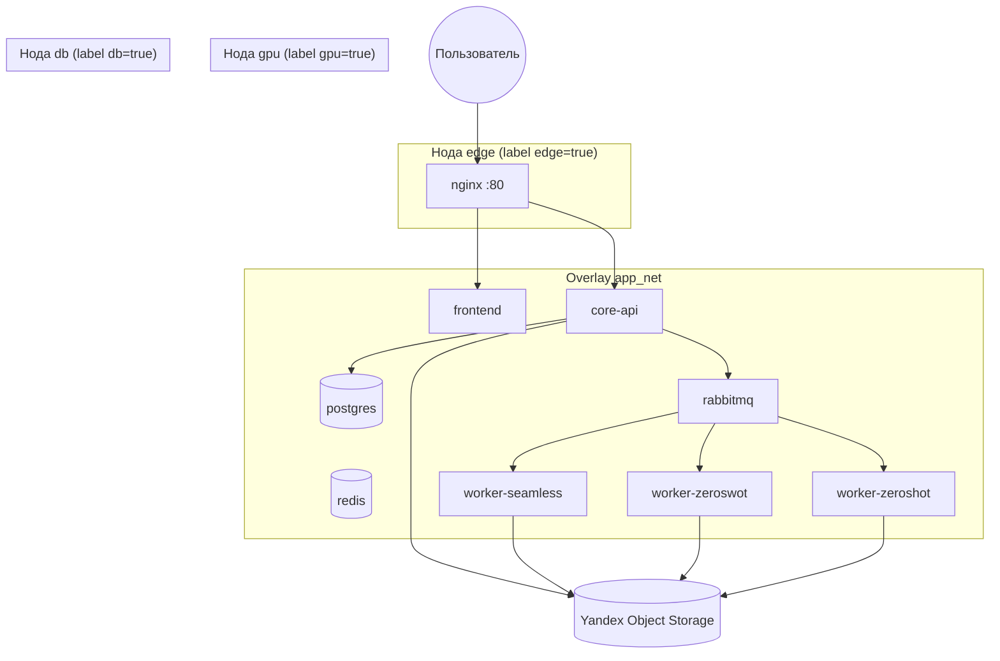

# Docker Swarm — развёртывание Multilingual Videos

Подробная инструкция: что входит в Swarm-инфраструктуру, как подготовить серверы и развернуть production-стек платформы перевода видео.

> **Когда использовать Swarm, а когда Compose**  
> `docker compose` — один хост, dev или простой prod.  
> **Docker Swarm** — несколько серверов, placement по ролям (БД / GPU / edge), rolling update, отказоустойчивость.

---

## Содержание

1. [Архитектура](#1-архитектура)
2. [Два сервера: CPU + GPU](#2-два-сервера-cpu--gpu) ← **пошаговый сценарий**
3. [Файлы и стеки](#3-файлы-и-стеки)
4. [Сервисы приложения](#4-сервисы-приложения)
5. [Labels нод и топологии](#5-labels-нод-и-топологии)
6. [Требования к серверам](#6-требования-к-серверам)
7. [Подготовка окружения](#7-подготовка-окружения)
8. [Развёртывание: одна нода (GPU-сервер)](#8-развёртывание-одна-нода-gpu-сервер)
9. [Развёртывание: несколько нод](#9-развёртывание-несколько-нод)
10. [Сборка образов и registry](#10-сборка-образов-и-registry)
11. [Мониторинг: Portainer и Flower](#11-мониторинг-portainer-и-flower)
12. [Эксплуатация](#12-эксплуатация)
13. [Обновление и откат](#13-обновление-и-откат)
14. [Устранение неполадок](#14-устранение-неполадок)
15. [Отличия от docker compose](#15-отличия-от-docker-compose)

---

## 2. Два сервера: CPU + GPU

Типичная схема для диплома / thesis prod:

| Сервер | Swarm | Labels | Сервисы |
|--------|-------|--------|---------|
| CPU | **manager** | `db`, `edge` | postgres, rabbitmq, redis, API, frontend, nginx |
| GPU | worker | `gpu` | три ML-воркера |

**Пошаговая инструкция целиком:** **[DEPLOY-2-NODES.md](DEPLOY-2-NODES.md)**

Кратко:

1. На CPU: `docker swarm init`, labels `db` + `edge` (**без** `gpu`).
2. На GPU: `docker swarm join`, label `gpu` (**без** `db`/`edge`).
3. Seamless-модель — на диск GPU-сервера (`/opt/models/...`).
4. Worker-образы должны быть на GPU (registry или `docker save` / `scp` / `load`).
5. Deploy только с CPU: `./scripts/swarm-deploy.sh`.

---

## 1. Архитектура

Платформа состоит из HTTP API, фронтенда, очереди задач и трёх ML-воркеров (разные модели перевода). В Swarm всё это — **stack** `multilingual-vids` в overlay-сети `app_net`.



**Поток перевода видео:**

1. Браузер → `POST /api/v1/videos/upload-url` → presigned URL на S3.
2. Браузер загружает файл в S3.
3. `POST /api/v1/videos` → запись в Postgres, задача в RabbitMQ (очередь `seamless` / `zeroswot` / `zeroshot`).
4. Воркер скачивает видео, переводит, кладёт результат в S3, обновляет статус в БД.
5. Пользователь скачивает готовое видео через `/api/v1/videos/{id}/download`.

Снаружи кластера открыт только **HTTP-порт nginx** (по умолчанию 80). Postgres, RabbitMQ и Redis — только внутри overlay-сети.

---

## 2. Файлы и стеки

Каталог `infra/swarm/`:

| Файл | Stack | Назначение |
|------|-------|------------|
| `stack.yml` | `multilingual-vids` | Основное приложение |
| `stack.gpu.yml` | overlay к `multilingual-vids` | GPU, bind-mount Seamless |
| `stack.ops.yml` | overlay к `multilingual-vids` | Flower (Celery UI) |
| `stack.portainer.yml` | `portainer` | UI кластера (отдельно) |
| `env/stack.env` | — | `IMAGE_TAG`, порты, имя stack |
| `env/stack.env.example` | — | Шаблон |

Скрипты в `scripts/`:

| Скрипт | Действие |
|--------|----------|
| `swarm-init.sh` | `docker swarm init`, labels на manager |
| `swarm-label-node.sh` | Labels `db` / `gpu` / `edge` на ноде |
| `swarm-build-images.sh` | Сборка всех образов приложения |
| `swarm-deploy.sh` | Deploy stack `multilingual-vids` |
| `swarm-deploy-portainer.sh` | Deploy stack `portainer` |
| `swarm-remove.sh` | Удалить stack приложения |

**Важно:** в Swarm **нет `build:`** в stack-файлах — образы нужно собрать (или pull из registry) **до** `docker stack deploy`.

---

## 3. Сервисы приложения

### Инфраструктура (label `db=true`)

| Сервис | Образ | Volume | Роль |
|--------|-------|--------|------|
| `postgres` | `postgres:15-alpine` | `pg_data` | БД: видео, модели, языки, Celery results |
| `rabbitmq` | `rabbitmq:3-management-alpine` | `rabbitmq_data` | Брокер Celery |
| `redis` | `redis:7-alpine` | `redis_data` | Зарезервирован (broker в prod — RabbitMQ) |

### Приложение

| Сервис | Образ | Label | Описание |
|--------|-------|-------|----------|
| `core-api` | `multilingual-vids/core-api:TAG` | `db=true` | Django REST API, migrate + gunicorn при старте |
| `frontend` | `multilingual-vids/frontend:TAG` | `db=true` | SPA (статика) |
| `nginx` | `nginx:1.27-alpine` | `edge=true` | Reverse proxy, порт 80 (`mode: host`) |

### ML-воркеры (label `gpu=true`, по 1 GPU на сервис)

| Сервис | Очередь | Модель | Особенности |
|--------|---------|--------|-------------|
| `worker-seamless` | `seamless` | SeamlessM4T v2 Large | Модель с **хоста** (`SEAMLESS_HOST_MODEL_DIR`), offline HF |
| `worker-zeroswot` | `zeroswot` | ZeroSwot + NLLB | Скачивает веса с Hugging Face в `hf_cache` |
| `worker-zeroshot` | `zeroshot` | Whisper + MT + TTS | MT из S3 (`ZEROSHOT_MT_S3_PREFIX`) |

Общие volume воркеров: `hf_cache`, `torch_cache` (кэш моделей между рестартами).

### Volumes (данные сохраняются при redeploy)

| Volume | Содержимое |
|--------|------------|
| `pg_data` | PostgreSQL |
| `rabbitmq_data` | Очереди RabbitMQ |
| `redis_data` | Redis AOF |
| `hf_cache` | Hugging Face cache |
| `torch_cache` | PyTorch cache |

### Configs

| Config | Источник |
|--------|----------|
| `nginx_prod_conf` | `infra/nginx/prod.conf` |

---

## 4. Labels нод и топологии

Placement constraints в `stack.yml` привязывают сервисы к нодам через **labels**:

| Label | Сервисы |
|-------|---------|
| `db=true` | postgres, rabbitmq, redis |
| `gpu=true` | worker-seamless, worker-zeroswot, worker-zeroshot |
| `edge=true` | nginx (единственная точка входа HTTP) |

### Сценарий A: один GPU-сервер (типичный диплом / thesis prod)

Все labels на одной машине — делает `swarm-init.sh`, если есть `nvidia-smi`:

```text
manager (единственная нода): db + edge + gpu
```

### Сценарий B: три роли

```text
manager-1:  db + edge          (БД, nginx, core-api, frontend)
gpu-1:      gpu                (все ML-воркеры)
gpu-2:      gpu                (опционально: scale воркеров)
```

На `gpu-1` должна лежать папка Seamless: `SEAMLESS_HOST_MODEL_DIR` (bind mount только на ноде, где крутится `worker-seamless`).

### Сценарий C: отключить ML-воркер без удаления сервиса

В `.envs/.worker-seamless` (и аналогах):

```bash
WORKER_ENABLED=false
```

Воркер стартует, но не грузит модель; задачи для этой модели → `ERROR` в БД.

---

## 5. Требования к серверам

### Минимум (одна нода)

| Ресурс | Рекомендация |
|--------|--------------|
| CPU | 8+ vCPU |
| RAM | 32 GB (ML-модели + Postgres) |
| Disk | 100+ GB SSD (модели Seamless ~5 GB, HF cache, БД) |
| GPU | NVIDIA 16+ GB VRAM (для трёх воркеров лучше 24 GB или один активный воркер) |
| ОС | Ubuntu 22.04 LTS |
| Docker | Engine 24+, Swarm mode |

### GPU-нода

1. [NVIDIA Driver](https://www.nvidia.com/Download/index.aspx)
2. [NVIDIA Container Toolkit](https://docs.nvidia.com/datacenter/cloud-native/container-toolkit/install-guide.html)
3. Проверка: `nvidia-smi` и `docker run --rm --gpus all nvidia/cuda:12.4.1-base-ubuntu22.04 nvidia-smi`

Для **нескольких GPU-нод** в Swarm может понадобиться [advertise GPU resources](https://docs.nvidia.com/datacenter/cloud-native/container-toolkit/latest/docker-swarm.html) (`nvidia-container-cli swarm`). На одной ноде достаточно label `gpu=true`.

### Внешние зависимости

| Сервис | Назначение |
|--------|------------|
| **Yandex Object Storage** | Загрузка видео, результаты, артефакты, MT-модель zeroshot |
| **Интернет** (первая установка) | ZeroSwot/NLLB — pull с Hugging Face в `hf_cache` |

---

## 6. Подготовка окружения

Все команды — из корня репозитория `multilingual-vids/`.

### 6.1. Клонирование и env-файлы

```bash
cd multilingual-vids

mkdir -p .envs
cp .envs_examples/.db .envs/.db
cp .envs_examples/.broker .envs/.broker
cp .envs_examples/.s3 .envs/.s3
cp .envs_examples/.core-api .envs/.core-api
cp .envs_examples/.worker .envs/.worker
cp .envs_examples/.worker-seamless .envs/.worker-seamless
cp .envs_examples/.worker-zeroswot .envs/.worker-zeroswot
cp .envs_examples/.worker-zeroshot .envs/.worker-zeroshot
cp .envs_examples/.deploy .envs/.deploy

cp infra/swarm/env/stack.env.example infra/swarm/env/stack.env
```

### 6.2. Что обязательно отредактировать

**`.envs/.db`** — пароль Postgres (должен совпадать в `DATABASE_URL`):

```bash
POSTGRES_PASSWORD=<strong-password>
DATABASE_URL=postgres://mv:<strong-password>@postgres:5432/multilingual_videos
```

**`.envs/.core-api`**:

```bash
DJANGO_SECRET_KEY=<random-50-chars>
DEBUG=false
ALLOWED_HOSTS=your.domain,localhost
CORS_ALLOWED_ORIGINS=https://your.domain
DATABASE_URL=postgres://mv:<password>@postgres:5432/multilingual_videos
```

**`.envs/.s3`** — ключи Yandex Cloud:

```bash
YANDEX_S3_ACCESS_KEY_ID=...
YANDEX_S3_SECRET_ACCESS_KEY=...
YANDEX_S3_BUCKET_UPLOADS=your-bucket
YANDEX_S3_BUCKET_RESULTS=your-bucket
YANDEX_S3_BUCKET_TEMP=your-bucket
S3_CORS_ALLOWED_ORIGINS=https://your.domain
```

**`.envs/.worker`** — тот же `DJANGO_SECRET_KEY` и `DATABASE_URL`, что у API.

**`infra/swarm/env/stack.env`**:

```bash
HTTP_PORT=80
SEAMLESS_HOST_MODEL_DIR=/opt/models/seamless-m4t-v2-large
ALLOWED_HOSTS=your.domain
CORS_ALLOWED_ORIGINS=https://your.domain
```

### 6.3. Модель SeamlessM4T на хосте

```bash
sudo mkdir -p /opt/models
python scripts/download-hf-model.py facebook/seamless-m4t-v2-large \
  --output-dir /opt/models/seamless-m4t-v2-large
```

Путь должен совпадать с `SEAMLESS_HOST_MODEL_DIR` в `stack.env` / `.envs/.deploy`.

### 6.4. Zeroshot MT в S3

В бакете должен быть префикс `models/zeroshot/trained_8/` (SavedModel), см. README проекта.  
Переменная уже задана в stack: `ZEROSHOT_MT_S3_PREFIX=models/zeroshot/trained_8`.

### 6.5. CORS на бакете (один раз)

После первого deploy API:

```bash
docker exec -it $(docker ps -q -f name=multilingual-vids_core-api | head -1) \
  python manage.py configure_s3_cors
```

---

## 7. Развёртывание: одна нода (GPU-сервер)

Пошаговый сценарий «с нуля» на одном сервере.

### Шаг 1. Swarm

```bash
chmod +x scripts/swarm-*.sh
./scripts/swarm-init.sh
```

Скрипт выполняет:

- `docker swarm init`
- labels `db=true`, `edge=true` на manager
- `gpu=true`, если работает `nvidia-smi`

Проверка:

```bash
docker node ls
docker node inspect self --format '{{ .Spec.Labels }}'
# ожидается: db edge gpu (на GPU-машине)
```

### Шаг 2. Сборка образов

```bash
./scripts/swarm-build-images.sh
```

Собираются (тег по умолчанию `multilingual-vids/*:latest`):

- `core-api`, `frontend`
- `worker-seamless`, `worker-zeroswot`, `worker-zeroshot`, `worker-cpu`
- Сборка GPU-образов **долгая** (PyTorch + CUDA).

### Шаг 3. Deploy приложения

```bash
./scripts/swarm-deploy.sh
```

Подключаются `stack.yml` + `stack.gpu.yml`.  
Без GPU (только для отладки инфраструктуры): `./scripts/swarm-deploy.sh --no-gpu` — воркеры не получат GPU и не смогут переводить.

Ожидание готовности (1–3 мин, дольше при первом pull postgres/rabbitmq):

```bash
watch docker stack services multilingual-vids
```

Все `REPLICAS` должны стать `1/1`.

### Шаг 4. Проверка

```bash
curl -s http://localhost/health
# {"status":"ok","service":"core-api"}

curl -s http://localhost/ready
# {"status":"ready",...}
```

Логи API:

```bash
docker service logs multilingual-vids_core-api -f --tail 50
```

### Шаг 5. Django superuser

```bash
CONTAINER=$(docker ps -q -f name=multilingual-vids_core-api | head -1)
docker exec -it "$CONTAINER" python manage.py createsuperuser
```

Админ: `http://<server>/admin/`

### Шаг 6. (Опционально) Portainer + Flower

```bash
./scripts/swarm-deploy-portainer.sh
# https://<server>:9443

./scripts/swarm-deploy.sh --with-ops
# http://<server>:5555 — Celery Flower
```

---

## 8. Развёртывание: несколько нод

### Шаг 1. Manager

На первом сервере — разделы 6 и 7 (init, env, build, deploy можно отложить до join).

```bash
./scripts/swarm-init.sh
# сохраните команду join для workers:
docker swarm join-token worker
```

### Шаг 2. Workers

На каждом дополнительном сервере:

```bash
docker swarm join --token <TOKEN> <MANAGER_IP>:2377
```

### Шаг 3. Labels

```bash
docker node ls

# GPU-сервер:
./scripts/swarm-label-node.sh <NODE_ID> gpu

# Сервер только для БД (опционально):
./scripts/swarm-label-node.sh <NODE_ID> db

# Edge/nginx (если не manager):
./scripts/swarm-label-node.sh <NODE_ID> edge
```

На GPU-ноде скопируйте Seamless-модель в `SEAMLESS_HOST_MODEL_DIR`.

### Шаг 4. Образы на всех нодах

Swarm не собирает на воркерах. Варианты:

**A. Private registry (рекомендуется для multi-node):**

```bash
# на build-машине
export IMAGE_PREFIX=registry.example.com/mv/
export IMAGE_TAG=v1.0.0
./scripts/swarm-build-images.sh

for img in core-api frontend worker-seamless worker-zeroswot worker-zeroshot worker-cpu; do
  docker tag multilingual-vids/$img:latest ${IMAGE_PREFIX}$img:${IMAGE_TAG}
  docker push ${IMAGE_PREFIX}$img:${IMAGE_TAG}
done

# на каждой ноде: docker login registry.example.com
./scripts/swarm-deploy.sh
```

**B. Одна нода для build:** `docker save` / `docker load` — только для lab, не для prod.

### Шаг 5. Deploy

```bash
./scripts/swarm-deploy.sh
./scripts/swarm-deploy-portainer.sh   # опционально
```

HTTP открывается на ноде с `edge=true` (порт 80, host mode).

---

## 9. Сборка образов и registry

Переменные в `infra/swarm/env/stack.env`:

| Переменная | Пример | Смысл |
|------------|--------|-------|
| `IMAGE_PREFIX` | `registry.example.com/mv/` | Префикс образа |
| `IMAGE_TAG` | `v1.0.0` | Версия |
| `STACK_NAME` | `multilingual-vids` | Имя stack |
| `HTTP_PORT` | `80` | Порт nginx |
| `CORE_API_REPLICAS` | `1` | Реплики API |
| `FRONTEND_REPLICAS` | `1` | Реплики frontend |

Имена сервисов в Swarm: `{STACK_NAME}_{service}`, например `multilingual-vids_core-api`.

---

## 10. Мониторинг: Portainer и Flower

### Portainer — UI деплоя и кластера

```bash
./scripts/swarm-deploy-portainer.sh
```

| URL | Назначение |
|-----|------------|
| `https://<manager>:9443` | HTTPS UI (рекомендуется) |
| `http://<manager>:9000` | HTTP UI |

**Первый вход:**

1. Создать admin-пользователя.
2. **Get Started** → локальный Docker Swarm.
3. **Stacks → multilingual-vids** — сервисы, логи, scale, redeploy.
4. **Services** — состояние реплик, rolling update.
5. **Nodes** — labels, ресурсы.

**Безопасность:** не публикуй 9000/9443 в интернет; используй VPN, SSH tunnel (`ssh -L 9443:localhost:9443 user@server`) или firewall.

Порты: `PORTAINER_HTTP_PORT`, `PORTAINER_HTTPS_PORT` в `stack.env`.

### Flower — мониторинг Celery

```bash
./scripts/swarm-deploy.sh --with-ops
```

`http://<manager>:5555` — активные/завершённые задачи `video.translate`, очереди.

### Прочие UI

| UI | URL | Назначение |
|----|-----|------------|
| Django Admin | `/admin/` | Видео, статусы, модели |
| Swagger | `/api/docs/` | API |
| CLI | — | `docker stack ps multilingual-vids` |

---

## 11. Эксплуатация

### Полезные команды

```bash
# Список сервисов и реплик
docker stack services multilingual-vids

# Задачи сервиса (на каких нодах)
docker service ps multilingual-vids_worker-seamless

# Логи
docker service logs multilingual-vids_worker-zeroswot -f --tail 100

# Масштаб API (если нужно)
docker service scale multilingual-vids_core-api=2

# Список volumes
docker volume ls | grep multilingual
```

### Отключение воркера

```bash
# в .envs/.worker-seamless
WORKER_ENABLED=false

./scripts/swarm-deploy.sh   # rolling update сервиса
```

### Создание superuser после redeploy

Контейнер API пересоздаётся; пользователи в Postgres сохраняются в `pg_data`.

---

## 12. Обновление и откат

### Rolling update (штатный)

```bash
export IMAGE_TAG=v1.0.1
./scripts/swarm-build-images.sh
# push в registry, если multi-node
./scripts/swarm-deploy.sh
```

В `stack.yml` настроено: `update_config.order: start-first`, `failure_action: rollback`.

### Откат сервиса вручную

```bash
docker service rollback multilingual-vids_core-api
```

### Полное удаление stack

```bash
./scripts/swarm-remove.sh
```

Volumes **не удаляются** автоматически. Удаление данных:

```bash
docker volume rm multilingual-vids_pg_data   # осторожно: потеря БД
```

---

## 13. Устранение неполадок

### Сервис `0/1` replicas, статус Pending

```bash
docker service ps multilingual-vids_<service> --no-trunc
```

| Сообщение | Решение |
|-----------|---------|
| `no suitable node (scheduling constraints)` | Нет ноды с нужным label (`db`, `gpu`, `edge`) |
| `insufficient resources` | Нет GPU на ноде с `gpu=true` |
| `invalid mount config` | `SEAMLESS_HOST_MODEL_DIR` не существует на GPU-ноде |

### `core-api` падает при старте

```bash
docker service logs multilingual-vids_core-api --tail 200
```

- Ошибка Postgres → проверь `DATABASE_URL`, доступность `postgres:5432` из overlay.
- Migrate failed → смотри SQL/миграции.

### Воркер не видит GPU

```bash
docker exec -it $(docker ps -q -f name=worker-seamless | head -1) nvidia-smi
```

Если ошибка — переустанови NVIDIA Container Toolkit, проверь label `gpu=true`.

### Задачи перевода в ERROR

1. Flower / логи воркера: `docker service logs multilingual-vids_worker-<model> -f`
2. `WORKER_ENABLED=false`?
3. S3 ключи / объект не загружен?
4. ZeroSwot: источник только `en`.

### Portainer не открывается

- Порт `mode: host` — UI только на **manager-ноде**, где запущена задача Portainer.
- `docker service ps portainer_portainer`

### env_file not found при deploy

Deploy запускай **из корня репозитория** (`scripts/swarm-deploy.sh` делает `cd` сам). На manager должна быть папка `.envs/` с файлами.

---

## 14. Отличия от docker compose

| | Docker Compose | Docker Swarm |
|---|----------------|--------------|
| Файлы | `docker-compose.yaml` + overlays | `infra/swarm/stack*.yml` |
| Сборка | `build:` в compose | `swarm-build-images.sh` |
| Зависимости | `depends_on` | healthcheck + restart |
| Сеть | bridge | overlay `app_net` |
| GPU | `devices` / `gpus` | `stack.gpu.yml`, labels |
| Масштаб | `scale` (compose v2) | `deploy.replicas`, `docker service scale` |
| Обновление | recreate containers | rolling update + rollback |
| Мониторинг | `--profile ops` (Portainer локально) | `swarm-deploy-portainer.sh` |

Локальная разработка без Swarm:

```bash
./scripts/compose-dev.sh up --build          # CPU, hot reload
./scripts/compose-prod.sh up -d --build      # один хост + GPU
docker compose --profile ops up -d portainer flower
```

---

## Чеклист первого prod-деплоя

- [ ] `.envs/*` заполнены (пароли, S3, `DJANGO_SECRET_KEY`)
- [ ] `infra/swarm/env/stack.env` — домен, порты, путь Seamless
- [ ] Seamless-модель в `SEAMLESS_HOST_MODEL_DIR`
- [ ] Zeroshot MT в S3
- [ ] CORS на бакете (`configure_s3_cors`)
- [ ] `./scripts/swarm-init.sh`
- [ ] `./scripts/swarm-build-images.sh`
- [ ] `./scripts/swarm-deploy.sh`
- [ ] `curl /health`, `createsuperuser`
- [ ] `./scripts/swarm-deploy-portainer.sh` (опционально)
- [ ] Тестовый перевод видео через UI
